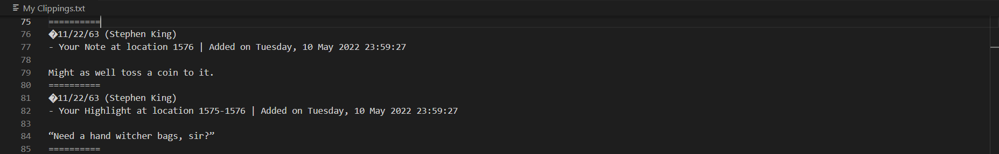
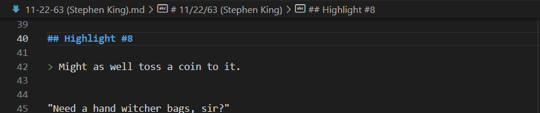
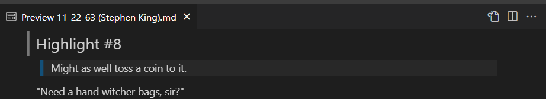

# kindle-clippings-parser

## But why tho?
The way Kindle puts all highlighted texts and notes in its "My Clippings.txt" file, in my opinion, is an abomination. It's a text file that's hardly readable, with no structure whatsoever applied to the highlights in relation to the titles, notes and bookmarks. The titles overlap with each other, there is no certainty when a highlight ends and another begins, notes are displyed exactly how regular highlight is displayed and can easily be skipped, and it just looks plain ugly. Simply put, "My Clipping.txt" file is chaos.

This software is a feeble attempt to remedy that. It's a Python file that can run through the clippings file and:
- create a markdown file for each title,
- put all the highlights for each title over there,
- separate each title with a header,
- the first line for each of your notes will be styled as a quote.

## An Example

### Sample section of a clippings file


### Sample corresponding output in MD


### How it would look with a markdown reader


## Prerequisites
All you need is **Python 3**, particularly a more recent build of Python that supports f-strings and type hints.

## Execution
Running this project simply means executing the "clippings-parser.py" Python file.

```sh
python clippings-parser.py

# or:
python3 clippings-parser.py
```

## Is it perfect?
No, certainly not. A large part of its issues will lie with how haphazardly Kindle organizes its highlights. For example, some notes texts are placed before the highlight from the book, and some after the highlight. So far, it hasn't been possible for me to point out whether the note belongs to the highlight above or the highlight below, so that issue is not solved by this software. Here, it will _always_ put the note _before_ the text that proceeds it, and therefore might give into some inaccuracies.

There might be a few other shortcomings, and a super-simple app like this means there is always room for improvement, and I will try to add more features to it if I get enough time. But for now, this will have to do.

## That's it
You may add more features to it by creating a PR. Hope this helps!
